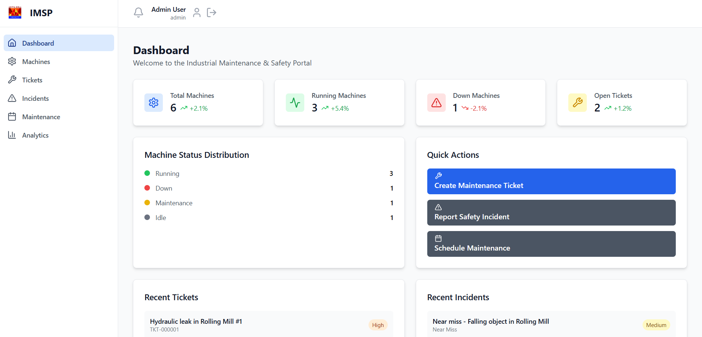
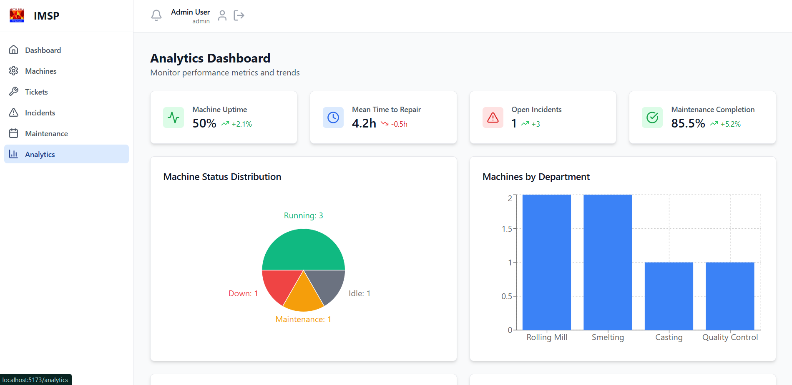
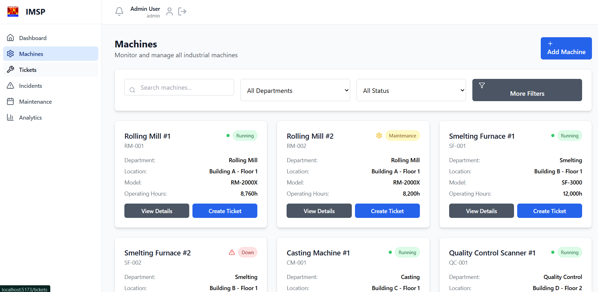

# 🚧 Hindalco Safety & Maintenance Platform

A powerful full-stack industrial web platform to manage 🏭 machines, 🛠 maintenance, 🧾 tickets, 🚨 incidents, 📊 analytics, and 👥 user roles — built for modern factory safety and efficiency.

🔗 **Live Demo**: [safety-management-f.onrender.com](https://safety-management-f.onrender.com/)

---

## 📸 Screenshots

| Dashboard | Analytics | Machine View |
|:---------:|:---------:|:------------:|
|  |  |  |

---

## ✨ Features

- 🔐 **JWT Authentication** – Secure login & registration
- 🛡 **Role-Based Access** – Users, Admins, and Managers
- 🏭 **Machine Management** – Add, edit, and monitor machine data
- 🎫 **Ticketing System** – Raise, track, and close maintenance tickets
- 🚨 **Incident Reporting** – Log industrial safety incidents
- 📅 **Maintenance Scheduler** – Preventive, predictive, corrective
- 📊 **Analytics Dashboard** – Interactive charts using Recharts
- 📁 **File Uploads** – Integrated with Cloudinary
- 📱 **Responsive UI** – Built with Tailwind CSS & Lucide icons

---

## 🧰 Tech Stack

**Frontend:**
- React + Vite
- Tailwind CSS, React Router
- Recharts, Lucide React

**Backend:**
- Node.js, Express.js
- MongoDB, Mongoose
- JWT, Multer, Cloudinary

**Other:**
- `dotenv`, `cors`, `react-hot-toast`

---

## 🚀 Getting Started

### 🔧 Prerequisites

- Node.js v18 or later
- MongoDB (Local or Atlas)
- Cloudinary account (for uploads)

---

### 1️⃣ Clone the Repo

```bash
git clone https://github.com/yourusername/imsp.git
cd imsp
```

---

### 2️⃣ Backend Setup

```bash
cd backend
npm install
```

📁 Create a `.env` file:

```env
NODE_ENV=development
PORT=5000
MONGODB_URI=mongodb://localhost:27017/imsp
JWT_SECRET=your-super-secret-jwt-key
CORS_ORIGIN=http://localhost:5173

# Cloudinary
CLOUDINARY_CLOUD_NAME=your-cloud-name
CLOUDINARY_API_KEY=your-api-key
CLOUDINARY_API_SECRET=your-api-secret
```

▶️ Start server:

```bash
npm start
```

---

### 3️⃣ Frontend Setup

```bash
cd ../frontend
npm install
npm run dev
```

Open [http://localhost:5173](http://localhost:5173) in your browser.

---

## 📁 Folder Structure

```
backend/
├── config/
├── models/
├── routes/
├── middlewares/
├── server.js
└── .env

frontend/
├── src/
│   ├── assets/
│   ├── components/
│   ├── contexts/
│   ├── pages/
│   └── App.jsx
├── screenshots/
├── tailwind.config.js
└── vite.config.js
```

---

## 🛠 Customization

- 🎨 **Tailwind Config:** Edit `tailwind.config.js` for theme tweaks.
- ☁️ **Cloudinary:** Setup in `backend/config/cloudinary.js` and `.env`
- 📊 **Charts:** Powered by [Recharts](https://recharts.org)

---

## 🧪 Scripts

### Backend

```bash
npm start       # Run backend
```

### Frontend

```bash
npm run dev     # Dev mode
npm run build   # Production build
```

---

## 🧯 Troubleshooting

- **Tailwind not loading?**
  - Check `@tailwind` in `index.css`
  - Restart Vite server after updates

- **MongoDB issues?**
  - Ensure your MongoDB URI is correct and server is running

- **Cloudinary not uploading?**
  - Double-check credentials in `.env`

---

## ⚖️ License

[MIT](https://choosealicense.com/licenses/mit/) © 2025 IMSP


## Credits

- [Lucide Icons](https://lucide.dev/)
- [Recharts](https://recharts.org/)
- [Tailwind CSS](https://tailwindcss.com/)
